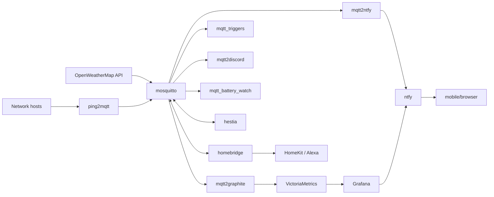

# home_automation

Home automation services running on `redwood`, a Debian 12 Linux router that doubles as a home automation hub. Each service is a Python microservice managed by systemd, with MQTT as the central message bus.

This repository is intended to be used along-side `claude`, the CLI interface to [Claude Code](https://code.claude.com/docs/en/overview). This is an example of a "pet" not "cattle". It's a proof of concept to show that agents can also be used for system administration tasks.

## How Humans Should Use This

Treat this like a jr sysadmin who learns quickly. Use plan mode to explain what you want to do and examine the plan. Explain what is wrong with the plan. When you are happy, accept the plan and watch it do complex sysadmin things.

### Sudo

To unleash the full power of this repo you will need to setup passwordless sudo. Usually you can `sudo visudo` and modify a line to include `NOPASSWD:` like this:

```
# Allow members of group sudo to execute any command
%sudo   ALL=(ALL:ALL) NOPASSWD: ALL
```

I understand this is a scary idea. The `.claude/settings.json` explicitly locks all sudo commands behind an Ask, so you will be prompted before it can do anything with sudo.

## Architecture

All services connect to a local [mosquitto](https://mosquitto.org/) MQTT broker at `127.0.0.1:1883`. Services either publish data to MQTT topics, subscribe to topics to trigger actions, or both. Time-series data flows from MQTT into VictoriaMetrics (via Graphite protocol) and is visualized in Grafana. Push notifications are delivered via a self-hosted ntfy server.



## System Services

Infrastructure services that the microservices depend on. These are not managed in this repo.

| Service | Unit | Port | What it does |
|---|---|---|---|
| mosquitto | `mosquitto.service` | 1883 | MQTT broker — central message bus |
| nginx | `nginx.service` | 80, 8079 | Reverse proxy; configs in `/etc/nginx/sites-enabled/` |
| ntfy | `ntfy.service` | 2586 | Push notification server at `http://redwood.lan:2586`; auth required; upstream [ntfy.sh](https://ntfy.sh) for mobile delivery |
| VictoriaMetrics | `victoria-metrics.service` | — | Time-series DB with Graphite-compatible ingestion |
| Grafana | `grafana-server.service` | — | Dashboard UI backed by VictoriaMetrics |
| PostgreSQL | `postgresql@15-main.service` | — | Database backend for meshview |
| homebridge | `homebridge.service` | 51872 / 8581 | HomeKit/Alexa bridge; exposes MQTT-connected devices (Z-Wave, Tasmota, Zigbee) via homebridge-mqttthing; config UI at port 8581; config in `/var/lib/homebridge/` |

## Services

| Directory | systemd unit | What it does |
|---|---|---|
| `hestia/` | `hestia-shed.service` | Thermostat: reads temperature probe, controls heater switch via MQTT. Topics: `heater/<name>/status`, `heater/<name>/set` |
| `mqtt_triggers/` | `mqtt_triggers.service` | Event-driven automation: motion-activated lights, door/window sensor alerts, bed light auto-off |
| `mqtt2discord/` | `mqtt2discord.service` | Forwards anything published to `discord/#` to a Discord webhook |
| `mqtt2graphite/` | `mqtt2graphite.service` | Buffers MQTT sensor readings and flushes to VictoriaMetrics every minute via Graphite protocol |
| `openweathermaps2mqtt/` | `openweathermaps2mqtt.service` | Fetches OpenWeatherMap forecast hourly and publishes flattened fields to `weather/*` |
| `ping2mqtt/` | `ping2mqtt.service` | Continuously pings configured hosts; publishes 10s/1m/5m rolling latency averages to `ping/*` |
| `mqtt_battery_watch/` | `mqtt_battery_watch.service` | Monitors charger power draw; publishes to `discord/bike_battery` when crossing a wattage threshold |
| `mqtt2ntfy/` | `mqtt2ntfy.service` | Forwards `ntfy/#` MQTT messages to ntfy push notification topics |

## Configuration

Each service is configured via environment variables set in its systemd unit file (typically in `/etc/systemd/system/<unit>.service` or an override). Common variables across services:

- `MQTT_HOST`, `MQTT_PORT`, `MQTT_USER`, `MQTT_PASS` — broker connection
- Service-specific topic and behavior settings

Each service directory has its own Python virtual environment at `.venv/` and a `requirements.txt`. All use `paho-mqtt<2`.

## Claude Skills

The `.claude/skills/` directory contains skill definitions used by Claude Code when running as a sysadmin assistant:

| Skill | Trigger | What it does |
|---|---|---|
| `status` | "status", "what's running" | Checks all service states; flags disk/memory/load issues |
| `logs` | "check logs", "anything concerning" | Reviews recent warnings/errors across services and system logs |
| `decommission` | "decommission \<service\>" | Guided workflow to safely retire a service and archive its code |

See `CLAUDE.md` for full system context and operating rules.

## Repo Notes

Service code directories (`hestia/`, `mqtt_triggers/`, etc.) are listed in `.gitignore` — each is a standalone environment managed independently. This repo tracks only:

- Claude skill definitions (`.claude/skills/`)
- `CLAUDE.md` — system context and sysadmin rules for Claude Code
- This README
